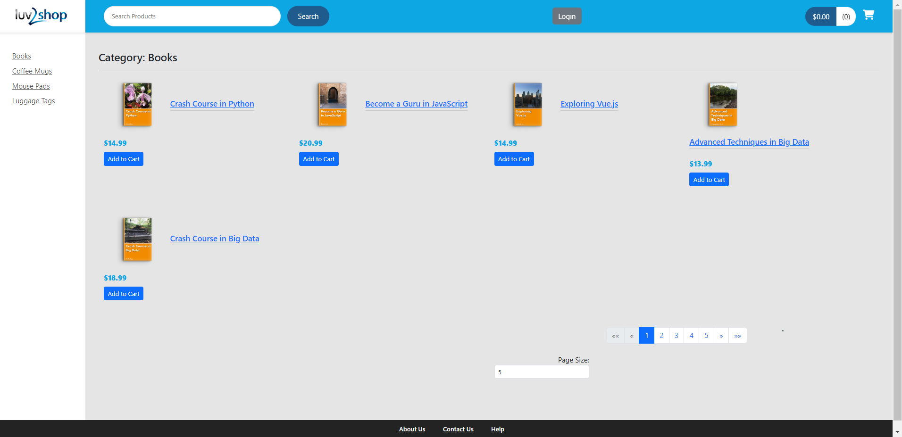
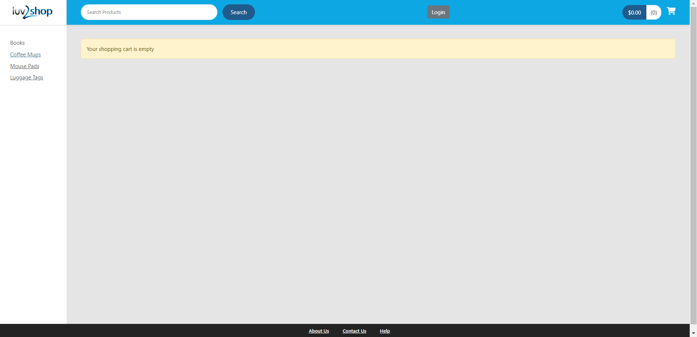

# E-commerce-website
An eCommerce website developed using Angular for the front end and Spring Boot for the back end, with MySQL for database management. The application includes security features Spring Boot Security provides and integrates Stripe for seamless payment processing.

## Screenshots

